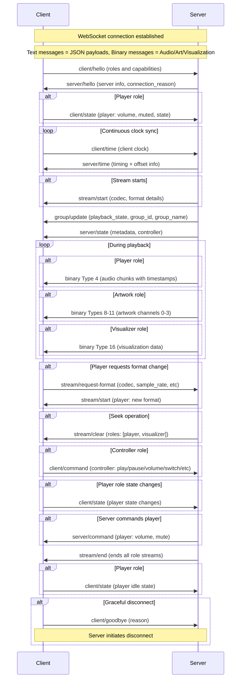

Sendspin is a multi-room music experience protocol. The goal of the protocol is to orchestrate all devices that make up the music listening experience. This includes outputting audio on multiple speakers simultaneously, screens and lights visualizing the audio or album art, and wall tablets providing media controls.

## Definitions

- **Sendspin Server** - orchestrates all devices, generates audio streams, manages players and clients, provides metadata
- **Sendspin Client** - a client that can play audio, visualize audio, display metadata, or provide music controls. Has different possible roles (player, metadata, controller, artwork, visualizer). Every client has a unique identifier
  - **Player** - receives audio and plays it in sync. Has its own volume and mute state and preferred format settings
  - **Controller** - controls the Sendspin group this client is part of
  - **Metadata** - displays text metadata (title, artist, album, etc.)
  - **Artwork** - displays artwork images. Has preferred format for images
  - **Visualizer** - visualizes music. Has preferred format for audio features
- **Sendspin Group** - a group of clients. Each client belongs to exactly one group, and every group has at least one client. Every group has a unique identifier. Each group has the following states: list of member clients, volume, mute, and playback state
- **Sendspin Stream** - client-specific details on how the server is formatting and sending binary data. Each role's stream is managed separately. Each client receives its own independently encoded stream based on its capabilities and preferences. For players, the server sends audio chunks as far ahead as the client's buffer capacity allows. For artwork clients, the server sends album artwork and other visual images through the stream

## Role Versioning

Roles define what capabilities and responsibilities a client has. All roles use explicit versioning with the `@` character: `<role>@<version>` (e.g., `player@v1`, `controller@v1`).

This specification defines the following roles: [`player`](#player-messages), [`controller`](#controller-messages), [`metadata`](#metadata-messages), [`artwork`](#artwork-messages), [`visualizer`](#visualizer-messages). All servers must implement all versions of these roles described in this specification.

All role names and versions not starting with `_` are reserved for future revisions of this specification.

### Priority and Activation

Clients list roles in `supported_roles` in priority order (most preferred first). If a client supports multiple versions of a role, all should be listed: `["player@v2", "player@v1"]`.

The server activates one version per role family (e.g., one `player@vN`, one `controller@vN`)—the first match it implements from the client's list. The server reports activated roles in `active_roles`.

Message object keys (e.g., `player?`, `controller?`) use unversioned role names. The server determines the appropriate version from the client's `active_roles`.

### Detecting Outdated Servers

Servers should track when clients request roles or role versions they don't implement (excluding those starting with `_`). This indicates the client supports a newer version of the specification and the server needs to be updated.

### Application-Specific Roles

Custom roles outside the specification start with `_` (e.g., `_myapp_controller`, `_custom_display`). Application-specific roles can also be versioned: `_myapp_visualizer@v2`.

## Establishing a Connection

Sendspin has two standard ways to establish connections: Server and Client initiated. Server Initiated connections are recommended as they provide standardized multi-server behavior, but require mDNS which may not be available in all environments.

Sendspin Servers must support both methods described below.

### Server Initiated Connections

Clients announce their presence via mDNS using:
- Service type: `_sendspin._tcp.local.`
- Port: The port the Sendspin client is listening on (recommended: `8928`)
- TXT record: `path` key specifying the WebSocket endpoint (recommended: `/sendspin`)

The server discovers available clients through mDNS and connects to each client via WebSocket using the advertised address and path.

**Note:** Do not manually connect to servers if you are advertising `_sendspin._tcp`.

#### Multiple Servers

In environments with multiple Sendspin servers, servers may need to reconnect to clients when starting playback to reclaim them. The [`server/hello`](#server--client-serverhello) message includes a `connection_reason` field indicating whether the server is connecting for general availability (`'discovery'`) or for active/upcoming playback (`'playback'`).

Clients can only be connected to one server at a time. Clients must persistently store the `server_id` of the server that most recently had `playback_state: 'playing'` (the "last played server").

When a second server connects, clients must:

1. **Accept incoming connections**: Complete the handshake (send [`client/hello`](#client--server-clienthello), receive [`server/hello`](#server--client-serverhello)) with the new server before making any decisions.

2. **Decide which server to keep**:
   - If the new server's `connection_reason` is `'playback'` → switch to new server
   - If the new server's `connection_reason` is `'discovery'` and the existing server connected with `'playback'` → keep existing server
   - If both servers have `connection_reason: 'discovery'`:
     - Prefer the server matching the stored last played server
     - If neither matches (or no history), keep the existing server

3. **Disconnect**: Send [`client/goodbye`](#client--server-clientgoodbye) with reason `'another_server'` to the server being disconnected, then close the connection.

### Client Initiated Connections

If clients prefer to initiate the connection instead of waiting for the server to connect, the server must be discoverable via mDNS using:
- Service type: `_sendspin-server._tcp.local.`
- Port: The port the Sendspin server is listening on (recommended: `8927`)
- TXT record: `path` key specifying the WebSocket endpoint (recommended: `/sendspin`)

Clients discover the server through mDNS and initiate a WebSocket connection using the advertised address and path.

**Note:** Do not advertise `_sendspin._tcp` if the client plans to initiate the connection.

#### Multiple Servers

Unlike server-initiated connections, servers cannot reclaim clients by reconnecting. How clients handle multiple discovered servers, server selection, and switching is implementation-defined.

**Note:** After this point, Sendspin works independently of how the connection was established. The Sendspin client is always the consumer of data like audio or metadata, regardless of who initiated the connection.

While custom connection methods are possible for specialized use cases (like remotely accessible web-browsers, mobile apps), most clients should use one of the two standardized methods above if possible.

## Communication

Once the connection is established, Client and Server are going to talk.

The first message must always be a `client/hello` message from the client to the server.
Once the server receives this message, it responds with a `server/hello` message. Before this handshake is complete, no other messages should be sent.

WebSocket text messages are used to send JSON payloads.

**Note:** In field definitions, `?` indicates an optional field (e.g., `field?`: type means the field may be omitted).

All messages have a `type` field identifying the message and a `payload` object containing message-specific data. The payload structure varies by message type and is detailed in each message section below.

Message format example:

```json
{
  "type": "stream/start",
  "payload": {
    "player": {
      "codec": "opus",
      "sample_rate": 48000,
      "channels": 2,
      "bit_depth": 16
    },
    "artwork": {
      "channels": [
        {
          "source": "album",
          "format": "jpeg",
          "width": 800,
          "height": 800
        }
      ]
    }
  }
}
```

WebSocket binary messages are used to send audio chunks, media art, and visualization data. The first byte is a uint8 representing the message type.

### Binary Message ID Structure

Binary message IDs typically use **bits 7-2** for role type and **bits 1-0** for message slot, allocating 4 IDs per role. Roles with expanded allocations use **bits 2-0** for message slot (8 IDs).

**Role assignments:**
- `000000xx` (0-3): Reserved for future use
- `000001xx` (4-7): Player role
- `000010xx` (8-11): Artwork role
- `000011xx` (12-15): Reserved for a future role
- `00010xxx` (16-23): Visualizer role
- Roles 6-47 (IDs 24-191): Reserved for future roles
- Roles 48-63 (IDs 192-255): Available for use by [application-specific roles](#application-specific-roles)

**Message slots:**
- Slot 0: `xxxxxx00`
- Slot 1: `xxxxxx01`
- Slot 2: `xxxxxx10`
- Slot 3: `xxxxxx11`

Roles with expanded allocations have slots 0-7.

**Note:** Role versions share the same binary message IDs (e.g., `player@v1` and `player@v2` both use IDs 4-7).

## Clock Synchronization

Clients continuously send `client/time` messages to maintain an accurate offset from the server's clock. The frequency of these messages is determined by the client based on network conditions and clock stability.

Binary audio messages contain timestamps in the server's time domain indicating when the audio should be played. Clients use their computed offset to translate server timestamps to their local clock for synchronized playback.

**Note**: For microsecond-level synchronization precision, consider using a two-dimensional Kalman filter to track both clock offset and drift. See the [time-filter](https://github.com/Sendspin-Protocol/time-filter) repository for a C++ implementation and [aiosendspin](https://github.com/Sendspin-Protocol/aiosendspin/blob/main/aiosendspin/client/time_sync.py) for a Python implementation.

## Playback Synchronization

- Each client is responsible for maintaining synchronization with the server's timestamps
- Clients maintain accurate sync by adding or removing samples using interpolation to compensate for clock drift
- When a client cannot maintain sync (e.g., buffer underrun), it should send the 'error' state via [`client/state`](#client--server-clientstate-player-object), mute its audio output, and continue buffering until it can resume synchronized playback, at which point it should send the 'synchronized' state
- The server is unaware of individual client synchronization accuracy - it simply broadcasts timestamped audio
- The server sends audio to late-joining clients with future timestamps only, allowing them to buffer and start playback in sync with existing clients
- Audio chunks may arrive with timestamps in the past due to network delays or buffering; clients should drop these late chunks to maintain sync



## Core messages
This section describes the fundamental messages that establish communication between clients and the server. These messages handle initial handshakes, ongoing clock synchronization, stream lifecycle management, and role-based state updates and commands.

Every Sendspin client and server must implement all messages in this section regardless of their specific roles. Role-specific object details are documented in their respective role sections and need to be implemented only if the client supports that role.

### Client → Server: `client/hello`

First message sent by the client after establishing the WebSocket connection. Contains information about the client's capabilities and roles.
This message will be followed by a [`server/hello`](#server--client-serverhello) message from the server.

Players that can output audio should have the role `player`.

- `client_id`: string - uniquely identifies the client for groups and de-duplication. Should remain persistent across reconnections so servers can associate clients with previous sessions (e.g., remembering group membership, settings, playback queue)
- `name`: string - friendly name of the client
- `device_info?`: object - optional information about the device
  - `product_name?`: string - device model/product name
  - `manufacturer?`: string - device manufacturer name
  - `software_version?`: string - software version of the client (not the Sendspin version)
- `version`: integer (must be `1`) - version of the core message format that the Sendspin client implements (independent of role versions)
- `supported_roles`: string[] - versioned roles supported by the client (e.g., `player@v1`, `controller@v1`). Defined versioned roles are:
  - `player@v1` - outputs audio
  - `controller@v1` - controls the current Sendspin group
  - `metadata@v1` - displays text metadata describing the currently playing audio
  - `artwork@v1` - displays artwork images
  - `visualizer@v1` - visualizes audio
- `player@v1_support?`: object - only if `player@v1` is listed ([see player@v1 support object details](#client--server-clienthello-playerv1-support-object))
- `artwork@v1_support?`: object - only if `artwork@v1` is listed ([see artwork@v1 support object details](#client--server-clienthello-artworkv1-support-object))
- `visualizer@v1_support?`: object - only if `visualizer@v1` is listed ([see visualizer@v1 support object details](#client--server-clienthello-visualizerv1-support-object))

**Note:** Each role version may have its own support object (e.g., `player@v1_support`, `player@v2_support`). Application-specific roles or role versions follow the same pattern (e.g., `_myapp_display@v1_support`, `player@_experimental_support`).

### Client → Server: `client/time`

Sends current internal clock timestamp (in microseconds) to the server.
Once received, the server responds with a [`server/time`](#server--client-servertime) message containing timing information to establish clock offsets.

- `client_transmitted`: integer - client's internal clock timestamp in microseconds

### Server → Client: `server/hello`

Response to the [`client/hello`](#client--server-clienthello) message with information about the server.

Only after receiving this message should the client send any other messages (including [`client/time`](#client--server-clienttime) and the initial [`client/state`](#client--server-clientstate) message if the client has roles that require state updates).

- `server_id`: string - identifier of the server
- `name`: string - friendly name of the server
- `version`: integer (must be `1`) - version of the core message format that the server implements (independent of role versions)
- `active_roles`: string[] - versioned roles that are active for this client (e.g., `player@v1`, `controller@v1`)
- `connection_reason`: 'discovery' | 'playback' - only used for [server-initiated connections](#multiple-servers)
  - `discovery` - server is connecting for general availability (e.g., initial discovery, reconnection after connection loss)
  - `playback` - server needs client for active or upcoming playback

**Note:** Servers will always activate the client's [preferred](#priority-and-activation) version of each role. Checking `active_roles` is only necessary to detect outdated servers or confirm activation of [application-specific roles](#application-specific-roles).

### Server → Client: `server/time`

Response to the [`client/time`](#client--server-clienttime) message with timestamps to establish clock offsets.

For synchronization, all timing is relative to the server's monotonic clock. These timestamps have microsecond precision and are not necessarily based on epoch time.

- `client_transmitted`: integer - client's internal clock timestamp received in the `client/time` message
- `server_received`: integer - timestamp that the server received the `client/time` message in microseconds
- `server_transmitted`: integer - timestamp that the server transmitted this message in microseconds

### Client → Server: `client/state`

Client sends state updates to the server. Contains role-specific state objects based on the client's supported roles.

Must be sent immediately after receiving [`server/hello`](#server--client-serverhello) for roles that report state (such as `player`), and whenever any state changes thereafter.

For the initial message, include all state fields. For subsequent updates, only include fields that have changed. The server will merge these updates into existing state.

- `player?`: object - only if client has `player` role ([see player state object details](#client--server-clientstate-player-object))

[Application-specific roles](#application-specific-roles) may also include objects in this message (keys starting with `_`).

### Client → Server: `client/command`

Client sends commands to the server. Contains command objects based on the client's supported roles.

- `controller?`: object - only if client has `controller` role ([see controller command object details](#client--server-clientcommand-controller-object))

[Application-specific roles](#application-specific-roles) may also include objects in this message (keys starting with `_`).

### Server → Client: `server/state`

Server sends state updates to the client. Contains role-specific state objects.

Only include fields that have changed. The client will merge these updates into existing state. Fields set to `null` should be cleared from the client's state.

- `metadata?`: object - only sent to clients with `metadata` role ([see metadata state object details](#server--client-serverstate-metadata-object))
- `controller?`: object - only sent to clients with `controller` role ([see controller state object details](#server--client-serverstate-controller-object))

[Application-specific roles](#application-specific-roles) may also include objects in this message (keys starting with `_`).

### Server → Client: `server/command`

Server sends commands to the client. Contains role-specific command objects.

- `player?`: object - only sent to clients with `player` role ([see player command object details](#server--client-servercommand-player-object))

[Application-specific roles](#application-specific-roles) may also include objects in this message (keys starting with `_`).

### Server → Client: `stream/start`

Starts a stream for one or more roles. If sent for a role that already has an active stream, updates the stream configuration without clearing buffers.

- `player?`: object - only sent to clients with the `player` role ([see player object details](#server--client-streamstart-player-object))
- `artwork?`: object - only sent to clients with the `artwork` role ([see artwork object details](#server--client-streamstart-artwork-object))
- `visualizer?`: object - only sent to clients with the `visualizer` role ([see visualizer object details](#server--client-streamstart-visualizer-object))

[Application-specific roles](#application-specific-roles) may also include objects in this message (keys starting with `_`).

### Server → Client: `stream/clear`

Instructs clients to clear buffers without ending the stream. Used for seek operations.

- `roles?`: string[] - which roles to clear: '[player](#server--client-streamclear-player)', '[visualizer](#server--client-streamclear-visualizer)', or both. If omitted, clears both roles

[Application-specific roles](#application-specific-roles) may also be included in this array (names starting with `_`).

### Client → Server: `stream/request-format`

Request different stream format (upgrade or downgrade). Available for clients with the `player` or `artwork` role.

- `player?`: object - only for clients with the `player` role ([see player object details](#client--server-streamrequest-format-player-object))
- `artwork?`: object - only for clients with the `artwork` role ([see artwork object details](#client--server-streamrequest-format-artwork-object))

[Application-specific roles](#application-specific-roles) may also include objects in this message (keys starting with `_`).

Response: [`stream/start`](#server--client-streamstart) for the requested role(s) with the new format.

**Note:** Clients should use this message to adapt to changing network conditions, CPU constraints, or display requirements. The server maintains separate encoding for each client, allowing heterogeneous device capabilities within the same group.

### Server → Client: `stream/end`

Ends the stream for one or more roles. When received, clients should stop output and clear buffers for the specified roles.

- `roles?`: string[] - roles to end streams for ('player', 'artwork', 'visualizer'). If omitted, ends all active streams

[Application-specific roles](#application-specific-roles) may also be included in this array (names starting with `_`).

### Server → Client: `group/update`

State update of the group this client is part of.

Contains delta updates with only the changed fields. The client should merge these updates into existing state. Fields set to `null` should be cleared from the client's state.

- `playback_state?`: 'playing' | 'stopped' - playback state of the group
- `group_id?`: string - group identifier
- `group_name?`: string - friendly name of the group

### Client → Server: `client/goodbye`

Sent by the client before gracefully closing the connection. This allows the client to inform the server why it is disconnecting.

Upon receiving this message, the server should initiate the disconnect.

- `reason`: 'another_server' | 'shutdown' | 'restart' | 'user_request'
  - `another_server` - client is switching to a different Sendspin server. Server should not auto-reconnect but should show the client as available for future playback
  - `shutdown` - client is shutting down. Server should not auto-reconnect
  - `restart` - client is restarting and will reconnect. Server should auto-reconnect
  - `user_request` - user explicitly requested to disconnect from this server. Server should not auto-reconnect

**Note:** Clients may close the connection without sending this message (e.g., crash, network loss), or immediately after sending `client/goodbye` without waiting for the server to disconnect. When a client disconnects without sending `client/goodbye`, servers should assume the disconnect reason is `restart` and attempt to auto-reconnect.

## Player messages
This section describes messages specific to clients with the `player` role, which handle audio output and synchronized playback. Player clients receive timestamped audio data, manage their own volume and mute state, and can request different audio formats based on their capabilities and current conditions.

**Note:** Volume values (0-100) represent perceived loudness, not linear amplitude (e.g., volume 50 should be perceived as half as loud as volume 100). Players must convert these values to appropriate amplitude for their audio hardware.

### Client → Server: `client/hello` player@v1 support object

The `player@v1_support` object in [`client/hello`](#client--server-clienthello) has this structure:

- `player@v1_support`: object
  - `supported_formats`: object[] - list of supported audio formats in priority order (first is preferred)
    - `codec`: 'opus' | 'flac' | 'pcm' - codec identifier
    - `channels`: integer - supported number of channels (e.g., 1 = mono, 2 = stereo)
    - `sample_rate`: integer - sample rate in Hz (e.g., 44100)
    - `bit_depth`: integer - bit depth for this format (e.g., 16, 24)
  - `buffer_capacity`: integer - max size in bytes of compressed audio messages in the buffer that are yet to be played
  - `supported_commands`: string[] - subset of: 'volume', 'mute'

**Note:** Servers must support all audio codecs: 'opus', 'flac', and 'pcm'.

### Client → Server: `client/state` player object

The `player` object in [`client/state`](#client--server-clientstate) has this structure:

Informs the server of player state changes. Only for clients with the `player` role.

State updates must be sent whenever any state changes, including when the volume was changed through a `server/command` or via device controls.

- `player`: object
  - `state`: 'synchronized' | 'error' - state of the player, should always be `synchronized` unless there is an error preventing current or future playback (unable to keep up, issues keeping the clock in sync, etc)
  - `volume?`: integer - range 0-100, must be included if 'volume' is in `supported_commands` from [`player@v1_support`](#client--server-clienthello-playerv1-support-object)
  - `muted?`: boolean - mute state, must be included if 'mute' is in `supported_commands` from [`player@v1_support`](#client--server-clienthello-playerv1-support-object)

### Client → Server: `stream/request-format` player object

The `player` object in [`stream/request-format`](#client--server-streamrequest-format) has this structure:

- `player`: object
  - `codec?`: 'opus' | 'flac' | 'pcm' - requested codec identifier
  - `channels?`: integer - requested number of channels (e.g., 1 = mono, 2 = stereo)
  - `sample_rate?`: integer - requested sample rate in Hz (e.g., 44100, 48000)
  - `bit_depth?`: integer - requested bit depth (e.g., 16, 24)

Response: [`stream/start`](#server--client-streamstart) with the new format.

**Note:** Clients should use this message to adapt to changing network conditions or CPU constraints. The server maintains separate encoding for each client, allowing heterogeneous device capabilities within the same group.

### Server → Client: `server/command` player object

The `player` object in [`server/command`](#server--client-servercommand) has this structure:

Request the player to perform an action, e.g., change volume or mute state.

- `player`: object
  - `command`: 'volume' | 'mute' - should be one of the values listed in `supported_commands` in the [`player@v1_support`](#client--server-clienthello-playerv1-support-object) object in the [`client/hello`](#client--server-clienthello) message. Commands not in `supported_commands` are ignored by the client
  - `volume?`: integer - volume range 0-100, only set if `command` is `volume`
  - `mute?`: boolean - true to mute, false to unmute, only set if `command` is `mute`

### Server → Client: `stream/start` player object

The `player` object in [`stream/start`](#server--client-streamstart) has this structure:

- `player`: object
  - `codec`: string - codec to be used
  - `sample_rate`: integer - sample rate to be used
  - `channels`: integer - channels to be used
  - `bit_depth`: integer - bit depth to be used
  - `codec_header?`: string - Base64 encoded codec header (if necessary; e.g., FLAC)

### Server → Client: `stream/clear` player

When [`stream/clear`](#server--client-streamclear) includes the player role, clients should clear all buffered audio chunks and continue with chunks received after this message.

### Server → Client: Audio Chunks (Binary)

Binary messages should be rejected if there is no active stream.

- Byte 0: message type `4` (uint8)
- Bytes 1-8: timestamp (big-endian int64) - server clock time in microseconds when the first sample should be output
- Rest of bytes: encoded audio frame

The timestamp indicates when the first audio sample in this chunk should be output. Clients must translate this server timestamp to their local clock using the offset computed from clock synchronization. Clients should compensate for any known processing delays (e.g., DAC latency, audio buffer delays, amplifier delays) by accounting for these delays when submitting audio to the hardware.

## Controller messages
This section describes messages specific to clients with the `controller` role, which enables the client to control the Sendspin group this client is part of, and switch between groups.

Every client which lists the `controller` role in the `supported_roles` of the `client/hello` message needs to implement all messages in this section.

### Client → Server: `client/command` controller object

The `controller` object in [`client/command`](#client--server-clientcommand) has this structure:

Control the group that's playing and switch groups. Only valid from clients with the `controller` role.

- `controller`: object
  - `command`: 'play' | 'pause' | 'stop' | 'next' | 'previous' | 'volume' | 'mute' | 'repeat_off' | 'repeat_one' | 'repeat_all' | 'shuffle' | 'unshuffle' | 'switch' - should be one of the values listed in `supported_commands` from the [`server/state`](#server--client-serverstate-controller-object) `controller` object. Commands not in `supported_commands` are ignored by the server
  - `volume?`: integer - volume range 0-100, only set if `command` is `volume`
  - `mute?`: boolean - true to mute, false to unmute, only set if `command` is `mute`

#### Command behaviour

- 'play' - resume playback from current position. If nothing is currently playing, the server must try to resume the group's last playing media. This history should persist across server and client reboots
- 'pause' - pause playback at current position
- 'stop' - stop playback and reset position to beginning
- 'next' - skip to next track, chapter, etc.
- 'previous' - skip to previous track, chapter, restart current, etc.
- 'volume' - set group volume (requires `volume` parameter)
- 'mute' - set group mute state (requires `mute` parameter)
- 'repeat_off' - disable repeat mode
- 'repeat_one' - repeat the current track continuously
- 'repeat_all' - repeat all tracks continuously
- 'shuffle' - randomize playback order
- 'unshuffle' - restore original playback order
- 'switch' - move this client to the next group in a predefined cycle as described [below](#switch-command-cycle)

**Setting group volume:** When setting group volume via the 'volume' command, the server applies the following algorithm to preserve relative volume levels while achieving the requested volume as closely as player boundaries allow:

1. Calculate the delta: `delta = requested_volume - current_group_volume` (where current group volume is the average of all player volumes)
2. Apply the delta to each player's volume
3. Clamp any player volumes that exceed boundaries (0-100%)
4. If any players were clamped:
   - Calculate the lost delta: `sum of (proposed_volume - clamped_volume)` for all clamped players
   - Divide the lost delta equally among non-clamped players
   - Repeat steps 1-4 until either:
     - All delta has been successfully applied, or
     - All players are clamped at their volume boundaries

This ensures that when setting group volume to 100%, all players will reach 100% if possible, and the final group volume matches the requested volume as closely as player boundaries allow.

**Setting group mute:** When setting group mute via the 'mute' command, the server applies the mute state to all players in the group.

#### Switch command cycle

For clients **with** the `player` role, the cycle includes:
1. Multi-client groups that are currently playing
2. Single-client groups (other players playing alone)
3. A solo group containing only this client

For clients **without** the `player` role, the cycle includes:
1. Multi-client groups that are currently playing
2. Single-client groups (other players playing alone)

### Server → Client: `server/state` controller object

The `controller` object in [`server/state`](#server--client-serverstate) has this structure:

- `controller`: object
  - `supported_commands`: string[] - subset of: 'play' | 'pause' | 'stop' | 'next' | 'previous' | 'volume' | 'mute' | 'repeat_off' | 'repeat_one' | 'repeat_all' | 'shuffle' | 'unshuffle' | 'switch'
  - `volume`: integer - volume of the whole group, range 0-100
  - `muted`: boolean - mute state of the whole group

**Reading group volume:** Group volume is calculated as the average of all player volumes in the group.

**Reading group mute:** Group mute is `true` only when all players in the group are muted. If some players are muted and others are not, group mute is `false`.

## Metadata messages
This section describes messages specific to clients with the `metadata` role, which handle display of track information and playback progress. Metadata clients receive state updates with track details.

### Server → Client: `server/state` metadata object

The `metadata` object in [`server/state`](#server--client-serverstate) has this structure:

- `metadata`: object
  - `timestamp`: integer - server clock time in microseconds for when this metadata is valid
  - `title?`: string | null - track title
  - `artist?`: string | null - primary artist(s)
  - `album_artist?`: string | null - album artist(s)
  - `album?`: string | null - name of the album or release that this track belongs to
  - `artwork_url?`: string | null - URL to artwork image. Useful for clients that want to forward metadata to external systems or for powerful clients that can fetch and process images themselves
  - `year?`: integer | null - release year in YYYY format
  - `track?`: integer | null - track number on the album (1-indexed), null if unknown or not applicable
  - `progress?`: object | null - playback progress information. The server must send this object whenever playback state changes (play, pause, resume, seek, playback speed change)
    - `track_progress`: integer - current playback position in milliseconds since start of track
    - `track_duration`: integer - total track length in milliseconds, 0 for unlimited/unknown duration (e.g., live radio streams)
    - `playback_speed`: integer - playback speed multiplier * 1000 (e.g., 1000 = normal speed, 1500 = 1.5x speed, 500 = 0.5x speed, 0 = paused)
  - `repeat?`: 'off' | 'one' | 'all' | null - repeat mode: 'off' = no repeat, 'one' = repeat current track, 'all' = repeat all tracks (in the queue, playlist, etc.)
  - `shuffle?`: boolean | null - shuffle mode enabled/disabled

#### Calculating current track position

Clients can calculate the current track position at any time using the `timestamp` and `progress` values from the last metadata message that included the `progress` object:

```python
calculated_progress = metadata.progress.track_progress + (current_time - metadata.timestamp) * metadata.progress.playback_speed / 1000000

if metadata.progress.track_duration != 0:
    current_track_progress_ms = max(min(calculated_progress, metadata.progress.track_duration), 0)
else:
    current_track_progress_ms = max(calculated_progress, 0)
```

## Artwork messages
This section describes messages specific to clients with the `artwork` role, which handle display of artwork images. Artwork clients receive images in their preferred format and resolution.

**Channels:** Artwork clients can support 1-4 independent channels, allowing them to display multiple related images. For example, a device could display album artwork on one channel while simultaneously showing artist photos or background images on other channels. Each channel operates independently with its own format, resolution, and source type (album or artist artwork).

### Client → Server: `client/hello` artwork@v1 support object

The `artwork@v1_support` object in [`client/hello`](#client--server-clienthello) has this structure:

- `artwork@v1_support`: object
  - `channels`: object[] - list of supported artwork channels (length 1-4), array index is the channel number
    - `source`: 'album' | 'artist' | 'none' - artwork source type
    - `format`: 'jpeg' | 'png' | 'bmp' - image format identifier
    - `media_width`: integer - max width in pixels
    - `media_height`: integer - max height in pixels

**Note:** The server will scale images to fit within the specified dimensions while preserving aspect ratio. Clients can support 1-4 independent artwork channels depending on their display capabilities. The channel number is determined by array position: `channels[0]` is channel 0 (binary message type 4), `channels[1]` is channel 1 (binary message type 5), etc.

**None source:** If a channel has `source` set to `none`, the server will not send any artwork data for that channel. This allows clients to disable and enable specific channels on the fly through [`stream/request-format`](#client--server-streamrequest-format-artwork-object) without needing to re-establish the WebSocket connection (useful for dynamic display layouts).

**Note:** Servers must support all image formats: 'jpeg', 'png', and 'bmp'.

### Client → Server: `stream/request-format` artwork object

The `artwork` object in [`stream/request-format`](#client--server-streamrequest-format) has this structure:

Request the server to change the artwork format for a specific channel. The client can send multiple `stream/request-format` messages to change formats on different channels.

After receiving this message, the server responds with [`stream/start`](#server--client-streamstart) for the artwork role with the new format, followed by immediate artwork updates through binary messages.

- `artwork`: object
  - `channel`: integer - channel number (0-3) corresponding to the channel index declared in the artwork [`client/hello`](#client--server-clienthello-artworkv1-support-object)
  - `source?`: 'album' | 'artist' | 'none' - artwork source type
  - `format?`: 'jpeg' | 'png' | 'bmp' - requested image format identifier
  - `media_width?`: integer - requested max width in pixels
  - `media_height?`: integer - requested max height in pixels

### Server → Client: `stream/start` artwork object

The `artwork` object in [`stream/start`](#server--client-streamstart) has this structure:

- `artwork`: object
  - `channels`: object[] - configuration for each active artwork channel, array index is the channel number
    - `source`: 'album' | 'artist' | 'none' - artwork source type
    - `format`: 'jpeg' | 'png' | 'bmp' - format of the encoded image
    - `width`: integer - width in pixels of the encoded image
    - `height`: integer - height in pixels of the encoded image

### Server → Client: Artwork (Binary)

Binary messages should be rejected if there is no active stream.

- Byte 0: message type `8`-`11` (uint8) - corresponds to artwork channel 0-3 respectively
- Bytes 1-8: timestamp (big-endian int64) - server clock time in microseconds when the image should be displayed by the device
- Rest of bytes: encoded image

The message type determines which artwork channel this image is for:
- Type `8`: Channel 0 (Artwork role, slot 0)
- Type `9`: Channel 1 (Artwork role, slot 1)
- Type `10`: Channel 2 (Artwork role, slot 2)
- Type `11`: Channel 3 (Artwork role, slot 3)

The timestamp indicates when this artwork should be displayed. Clients must translate this server timestamp to their local clock using the offset computed from clock synchronization.

**Clearing artwork:** To clear the currently displayed artwork on a specific channel, the server sends an empty binary message (only the message type byte and timestamp, with no image data) for that channel.

## Visualizer messages
This section describes messages specific to clients with the `visualizer` role, which create visual representations of the audio being played. Visualizer clients receive audio analysis data like FFT information that corresponds to the current audio timeline.

### Client → Server: `client/hello` visualizer@v1 support object

The `visualizer@v1_support` object in [`client/hello`](#client--server-clienthello) has this structure:

- `visualizer@v1_support`: object
  - Desired FFT details (to be determined)
  - `buffer_capacity`: integer - max size in bytes of visualization data messages in the buffer that are yet to be displayed

### Server → Client: `stream/start` visualizer object

The `visualizer` object in [`stream/start`](#server--client-streamstart) has this structure:

- `visualizer`: object
  - FFT details (to be determined)

### Server → Client: `stream/clear` visualizer

When [`stream/clear`](#server--client-streamclear) includes the visualizer role, clients should clear all buffered visualization data and continue with data received after this message.

### Server → Client: Visualization Data (Binary)

Binary messages should be rejected if there is no active stream.

- Byte 0: message type `16` (uint8)
- Bytes 1-8: timestamp (big-endian int64) - server clock time in microseconds when the visualization should be displayed by the device
- Rest of bytes: visualization data

The timestamp indicates when this visualization data should be displayed, corresponding to the audio timeline. Clients must translate this server timestamp to their local clock using the offset computed from clock synchronization.
